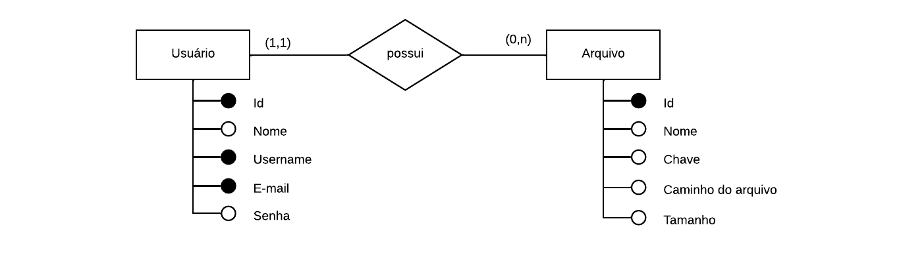
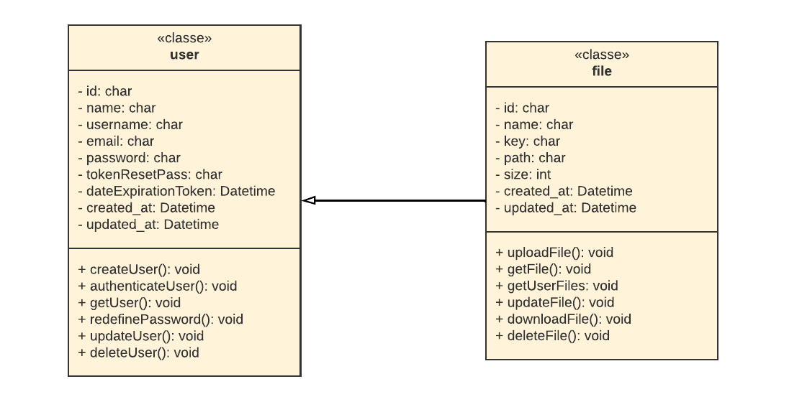
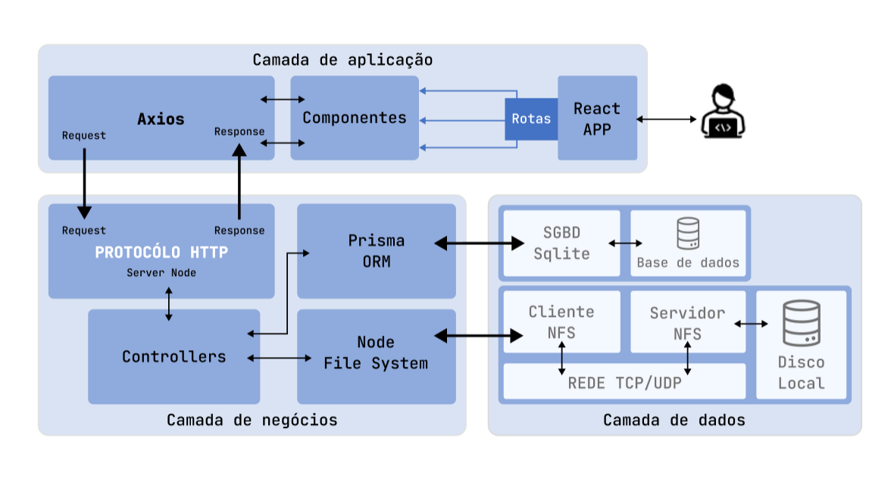
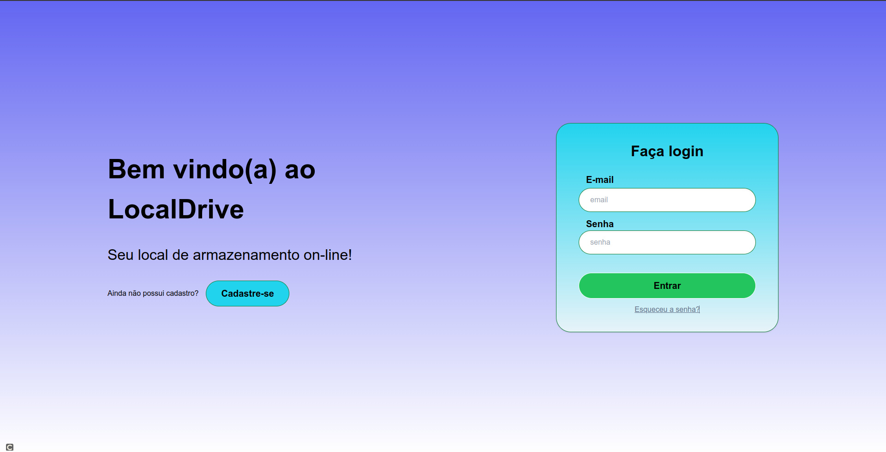
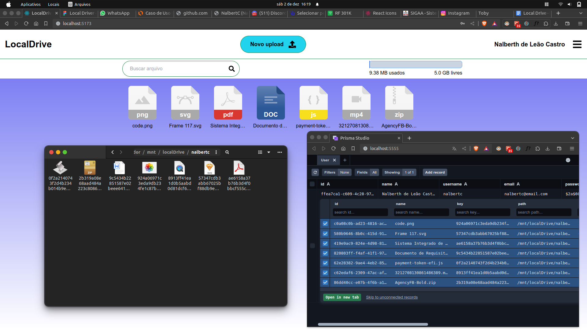
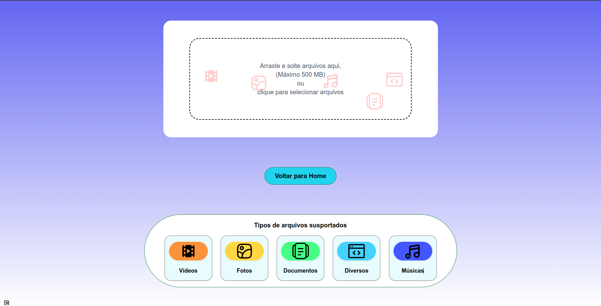
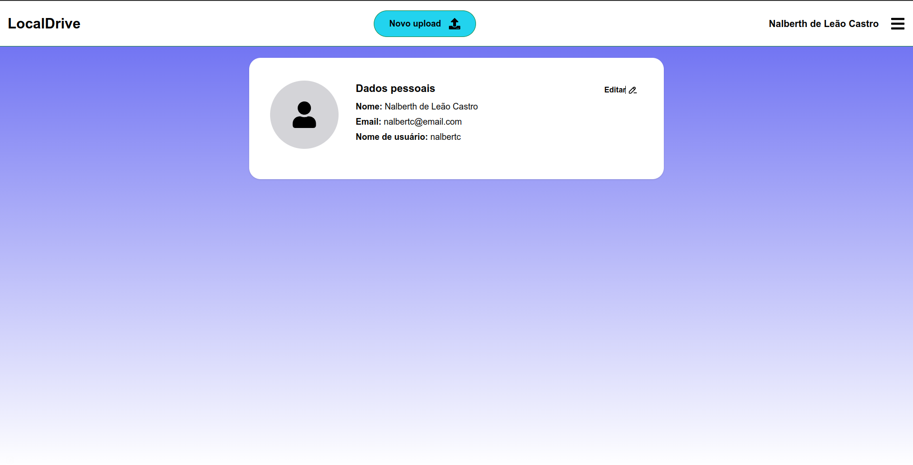

# LocalDrive: Uma Aplicação Web para Gerenciamento de Arquivos com NFS

Atividade avaliativa referente a disciplina de Projeto Integrado II do curso de Sistemas de Informação UFPA entrege dia 05/12/2023.

[links]().

#### Integrantes da equipe:
- Edilson de L. Leão - leaoedilson44@gmail.com;
- Klebson do C. Silva - klebsoncarmo1@gmail.com;
- Nalberth de L. Castro - nalberthcastro1510@gmail.com;
- Maick da S. Damasceno - maicksd2017@gmail.com;
- Wendew M. S. Magalhães - wm.magalhaes@outlook.com;

## Requisitos do Sistema

#### Requisitos Funcionais
Nome | Descrição
---- | -----
Criar perfil de usuário do Sistema | O usuário se cadastra no sistema, adicionando um nome de usuário, e-mail, e cria uma senha para acesso.
Fazer Login no sistema | O usuário poderá entrar no sistema utilizando e-mail e senha previamente cadastrados.
Fazer Upload de Arquivos | O usuário poderá fazer Uploads de arquivos locais para o sistema.
Gerenciar Arquivos | O usuário poderá manipular os arquivos de seu domínio dentro do sistema.
Fazer Download de Arquivos | O usuário poderá baixar os arquivos de seu domínio previamente enviados.
Gerenciar Perfil de Usuário | O usuário poderá gerenciar seu perfil dentro do sistema, alterando dados ou excluindo o cadastro.
Recuperar Senha de Acesso | O usuário poderá recuperar sua senha de acesso ao sistema.

#### Requisitos Não Funcionais
Nome | Descrição
---- | -----
Interface Intuitiva e Amigável | O usuário do sistema deve ter facilidade de uso do sistema, ou seja, realizar tarefas (inclusão, alteração, consulta, exclusão) com menos de 30 minutos de treinamento. Para confirmação disso, será realizado um teste de usabilidade.
Sistema WEB | O usuário utilizará o sistema através de um navegador web.
Segurança | O sistema deverá possuir login e senha individuais para cada usuário da interface de cadastro, de forma a restringir o seu acesso.
Limite no Tamanho de Arquivos para Upload | O sistema deverá limitar o envio de arquivos, não podendo ultrapassar 500 MB por upload.
Uso de NFS | O sistema deverá utilizar os serviços de NFS para gerenciamento de arquivos enviados pelos usuários.
Limites de Armazenamento |  O sistema deverá disponibilizar uma capacidade de armazenamento de 5 GB para cada usuário cadastrado.
Opções de Recuperação de Acesso | O sistema deverá oferecer opções de recuperação de acesso, em casos de perda das informações de login.

## Diagramas
#### Diagrama de Caso de Uso

#### Diagrama de Entidade e Relacionamento

#### Diagrama de Casses

## Estrutura do Sistema

## Implementação
#### NFS

Comando no terminal Unix | Descrição 
--- | ---
sudo apt-get install nfs-kernel-server | Para instalar pacotes do protocolo NFS.
sudo mkdir /mnt/server_nfs_localDrive /mnt/localDrive | Para criar os repositórios que funcionarão como servidor e cliente respectivamente.
sudo chmod 777 /mnt/server_nfs_localDrive /mnt/localDrive | Para adicionar as permissões de escrita e leitura  nos diretórios cliente e servidor.
sudo nano /etc/exports | Para configuração de caminhos e clientes NFS, e adicionado a configuração “/mnt/server_nfs_localDrive *(rw,sync,no_root_squash)” para definição de um cliente NFS e suas permissões de acesso ao servidor.
sudo systemctl restart nfs-server | Para reiniciar o servidor e ler o arquivo de configuração.
sudo apt-get install nfs-common | Para instalação do cliente NFS.
sudo mount 127.17.0.1:/mnt/server_nfs_localDrive /mnt/localDrive | Montar a unidade de conexão do cliente e atribuir a unidade do diretório disponível para o dispositivo que foi configurado no servidor NFS.

## Resultados
Tela de cadatro.

Tela de login.

Tela principal do sistema exibindo dados inseridos salvos no servidor NFS e banco de dados.

Tela de upload de arquivos.

Tela de perfil de usuário.
